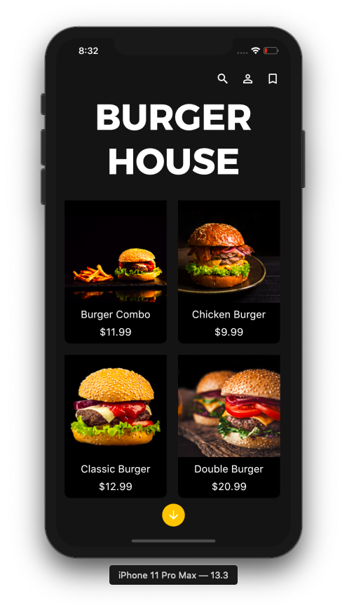
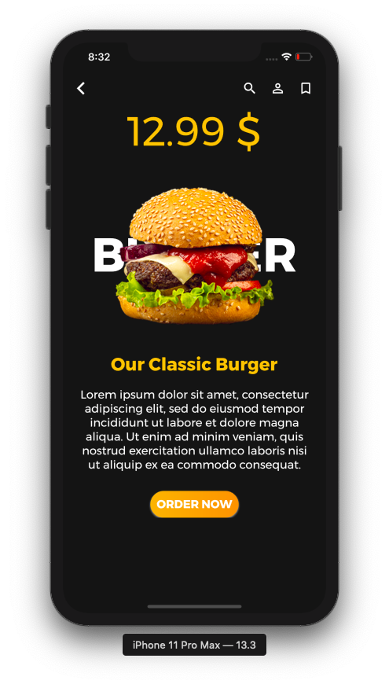

# Food App UI

Food App UI Created in Flutter

### Credits

Inspired by [UpLabs](https://www.uplabs.com/posts/food-ordering-app-like-uber-eats)

# Screenshots

## Created By

[Ganeshprasad Shenoy](https://github.com/shenoyganeshprasad)
[@ganeshprasad98](https://twitter.com/ganeshprasad98)

> If you found this project helpful or you learned something from the source code and want to thank me, consider buying me a cup of coffee

> [PayPal](https://www.paypal.com/paypalme2/shenoyganeshprasad)